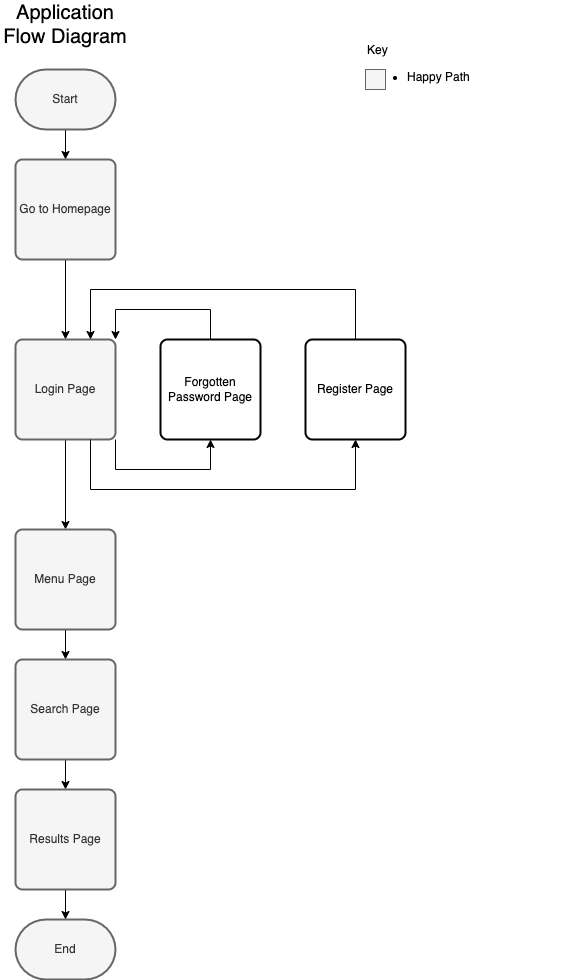
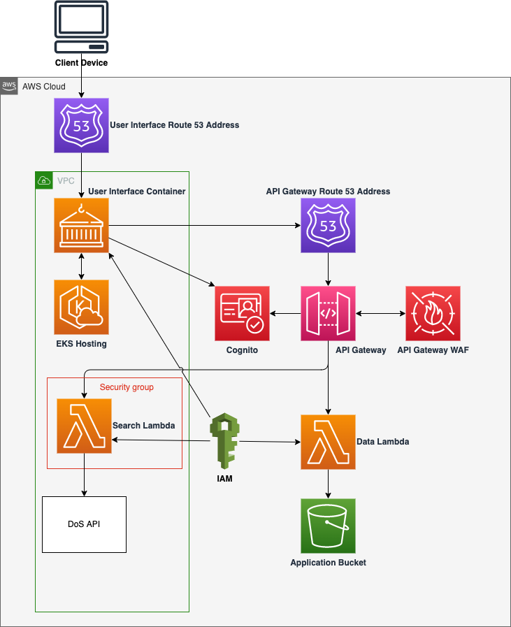

# DoS Comparison Tool

- [DoS Comparison Tool](#dos-comparison-tool)
  - [Overview](#overview)
  - [Quick Start](#quick-start)
    - [Development Requirements](#development-requirements)
    - [Local Environment Configuration](#local-environment-configuration)
    - [Local Project Setup](#local-project-setup)
  - [Contributing](#contributing)
  - [Development](#development)
    - [Local UI Development](#local-ui-development)
    - [Upgrade UI Dependencies](#upgrade-ui-dependencies)
  - [Testing](#testing)
    - [Unit tests](#unit-tests)
      - [Typescript Unit tests](#typescript-unit-tests)
    - [End to End tests](#end-to-end-tests)
    - [Test data and mock services](#test-data-and-mock-services)
    - [Manual check](#manual-check)
  - [Deployment](#deployment)
    - [Artifact Versioning](#artifact-versioning)
    - [CI/CD Pipelines](#cicd-pipelines)
      - [Development Pipeline](#development-pipeline)
    - [Stand alone CodeBuild Projects](#stand-alone-codebuild-projects)
      - [Clean up CodeBuild](#clean-up-codebuild)
    - [Pipeline Image](#pipeline-image)
    - [Deployment From the Command-line](#deployment-from-the-command-line)
    - [Secrets](#secrets)
    - [AWS Access](#aws-access)
  - [Architecture](#architecture)
    - [Diagrams](#diagrams)
      - [Processes and Data Flow](#processes-and-data-flow)
        - [Individual Processes Diagrams](#individual-processes-diagrams)
      - [Infrastructure](#infrastructure)
      - [Networking](#networking)
    - [Integration](#integration)
      - [Interfaces](#interfaces)
      - [Dependencies](#dependencies)
    - [Data](#data)
    - [Authentication and authorization](#authentication-and-authorization)
    - [Technology Stack](#technology-stack)
    - [Key Architectural Decisions](#key-architectural-decisions)
    - [System Quality Attributes](#system-quality-attributes)
    - [Guiding Principles](#guiding-principles)
  - [Operation](#operation)
    - [Error Handling](#error-handling)
    - [Observability](#observability)
    - [Auditing](#auditing)
    - [Backups](#backups)
    - [Cloud Environments](#cloud-environments)
  - [Product](#product)
    - [Documentation](#documentation)

## Overview

This is a tool to compare the output of two DoS environments. It is primarily intended to be used to compare the output of a check capacity summary search in each environment.

## Quick Start

### Development Requirements

- macOS operating system provisioned with the `curl -L bit.ly/make-devops-macos-setup | bash` command
- `iTerm2` command-line terminal and `Visual Studio Code` source code editor, which will be installed automatically for you in the next steps

### Local Environment Configuration

Clone the repository

    git clone [project-url]
    cd ./[project-dir]

The following is equivalent to the `curl -L bit.ly/make-devops-macos-setup | bash` command. If that step has already been done it can be omitted at this point

    make macos-setup

There are essential configuration options that **must** be set before proceeding any further. As a minimum the following command will ensure that tooling like `docker` and `git` are going to operate as expected, including local secret scanning and code formatting are enabled

    make setup

Please, ask one of your colleagues for the AWS account numbers used by the project. The next command will prompt you to provide them. This information can be sourced from a properly set up project by running `make show-configuration | grep ^AWS_ACCOUNT_ID_`

    make devops-setup-aws-accounts

Generate and trust a self-signed certificate that will be used locally to enable encryption in transit

    make trust-certificate

### Local Project Setup

    make setup
    make build
    make start log
    open https://localhost:8081

## Contributing

Here is the list of the development practices that have to be followed by the team and the individual members:

- Only use single canonical branch **main**. Any intermediate branch significantly increases the maintenance overhead of the repository.
- Apply the git rebase workflow and never merge from main to a task branch. Follow the **squash-rebase-merge** pattern to keep the history linear and clean.
- Cryptographically sign your commits using **gpg** to ensure its content have not been tampered with.
- Format the summary message of your pull request (merge request) using the following pattern **"JIRA-XXX Summary of the change being made"** for complines and clarity as well as to enable tooling to produce release notes automatically.
- Announce your PR/MR on the development Slack channel to allow any team member to review it and to share the knowledge. A change can be merged only if all comments have been addressed and it has been **approved by at least one peer**. Make good use of paring/mobbing/swarming practices for collaborative coding.

Before starting any work, please read [Contributing.md](documentation/Contributing.md) for more detailed instructions.

## Development

- Describe how to
  - Connect to a local database
  - Interact with mock components
  - Switch each individual component to the dev mode
- Code formatting
- Code quality
- Reference the [TODO.md](documentation/TODO.md) file
- Provide guidance on how to use feature toggles and branching by abstraction

### Local UI Development

To start the UI in development mode, run the following command. It assumes that you have already `tx-mfa` authenticated into the nonprod AWS account.
This will deploy/refresh the necessary AWS components and then initiate a local development server.

    make ui-start PROFILE=dev

Note: A `make clean` must be run after switching branches to ensure Terraform will apply to correct backend

### Upgrade UI Dependencies

To upgrade UI dependencies you can either use Dependabot which creates Pull Requests to upgrade individual libraries. Otherwise run the following commands:

    cd application/ui
    yarn dependency-update
    yarn dedupe
    // Run Tests

## Testing

List all the type of test suites included and provide instructions how to execute them

- Unit
- Integration
- Contract
- End-to-end
- Performance
- Security
- Smoke

How to run test suite in the pipeline

### Unit tests

Unit testing is a software testing method by which individual units of source code, sets of one or more computer program modules together with associated control data, usage procedures, and operating procedures, are tested to determine whether they are fit for use.

#### Typescript Unit tests

Unit Tests are written in Typescript and run using Jest. They are located in the `__test__` subdirectory of the code it's testing.

    make ui-test

### End to End tests

End to end testing is a software testing method that tests a software application from start to finish. It is a technique used to test whether the flow of an application is performing as designed from start to end.

These tests are written in python and run with pytest and pytest bdd. These tests are located in the `test/end_to_end` directory.

The prerequisites for running these tests are:

- AWS Cognito is setup and configured using `make provision-infrastructure PROFILE= ENVIRONMENT=`
- The UI is running locally or deployed to a nonprod environment. To run the UI locally, run `make ui-build start PROFILE= ENVIRONMENT=`

To run the end to end tests, run the following command:

    make end-to-end-test PROFILE= ENVIRONMENT=

Example:

    make end-to-end-test PROFILE=dev ENVIRONMENT=dev

To view the tests running in a browser, run the following command:

    make test-browser

### Test data and mock services

- How the test data set is produced
- Are there any mock services in place

### Manual check

Here are the steps to perform meaningful local system check:

- Log in to the system using a well known username role

## Deployment

### Artifact Versioning

E.g. semantic versioning vs. timestamp-based

### CI/CD Pipelines

List all the pipelines and their purpose

- Development

#### Development Pipeline

The development pipeline is triggered by a push to the main branch. It will run the unit tests, build the docker images and push them to the AWS ECR repository. It will then deploy the application to the dev environment and run the end to end tests.

### Stand alone CodeBuild Projects

- Clean up

#### Clean up CodeBuild

The clean up code build project removes all environments in non prod that aren't dev.

### Pipeline Image

### Deployment From the Command-line

    make deploy PROFILE=dev

### Secrets

Where are the secrets located, i.e. AWS Secrets Manager, under the `$(PROJECT_ID)-$(PROFILE)/deployment` secret name and variable `$(DEPLOYMENT_SECRETS)` should be set accordingly.

### AWS Access

To be able to interact with a remote environment, please make sure you have set up your AWS CLI credentials and
MFA to the right AWS account using the following command

    tx-mfa

## Architecture

### Diagrams

#### Processes and Data Flow

##### Individual Processes Diagrams

Individual processes diagrams are located in the [processes](./documentation/diagrams/processes/) directory.

#### Infrastructure

Include an image of the Infrastructure diagram. Please, be aware that any sensitive information that can be potentially misused either directly or indirectly must not be stored and accessible publicly. This could be IP addresses, domain names or detailed infrastructure information.

#### Networking

Include an image of the Networking diagram. Please, be aware that any sensitive information must not be stored and accessible publicly. This could be IP addresses, domain names or detailed networking information.

### Integration

#### Interfaces

Document all the system external interfaces

- API documentation should be generated automatically

#### Dependencies

Document all the system external dependencies and integration points

### Data

What sort of data system operates on and processes

- Data set
- Consistency and integrity
- Persistence

### Authentication and authorization

- Authentication and authorisation documentation can be found here -> <https://nhsd-confluence.digital.nhs.uk/display/DETS/DoS+Comparison+Tool>

### Technology Stack

Programming Languages and Frameworks

- Python
- Typescript, React, Redux

AWS Services

- AWS Lambda (Python)
- AWS Cognito

### Key Architectural Decisions

Link or include the abbreviated list of the ADRs

### System Quality Attributes

- Accessibility, usability
- Resilience, durability, fault-tolerance
- Scalability, elasticity
- Consistency
- Performance
- Interoperability
- Security
- Supportability

### Guiding Principles

List of the high level principles that a product /development team must adhere to:

- The solution has to be coded in the open - e.g. NHSD GitHub org
- Be based on the open standards, frameworks and libraries
- API-first design
- Test-first approach
- Apply the automate everything pattern
- AWS-based cloud solution deployable to the NHSD CPaaS Texas platform
- Use of the Make DevOps automation scripts (macOS and Linux)

## Operation

### Error Handling

- What is the system response under the erroneous conditions

### Observability

- Logging
  - Indexes
  - Format
- Tracing
  - Correlation ID
- Monitoring
  - Dashboards
- Alerting
  - Triggers
  - Service status
- Fitness functions
  - What do we measure?

What are the links of the supporting systems?

### Auditing

Are there any auditing requirements in accordance with the data retention policies?

### Backups

- Frequency and type of the backups
- Instructions on how to recover the data

### Cloud Environments

List all the environments and their relation to profiles

- Development
  - Profile: `dev`
  - URL address: [https://?.k8s-dev.texasplatform.uk/](https://?.k8s-dev.texasplatform.uk/)
  - Username: ?@nhs.net
  - Password: _stored in the AWS Secrets Manager `?`_
- Test
- Demo
- Live

Describe how to provision and deploy to a task branch environment

## Product

### Documentation

- Jira Board -> <https://nhsd-jira.digital.nhs.uk/secure/RapidBoard.jspa?rapidView=5617>
- Confluence Folder -> <https://nhsd-confluence.digital.nhs.uk/display/DETS/DoS+Comparison+Tool>
